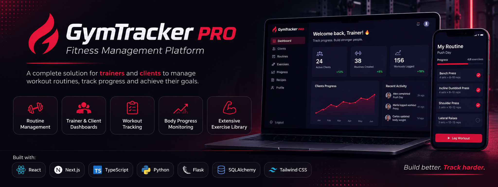
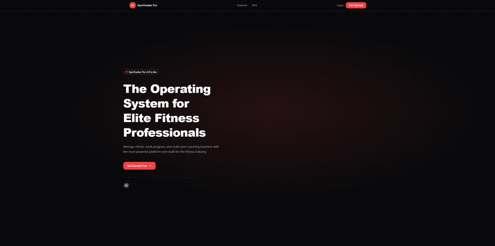
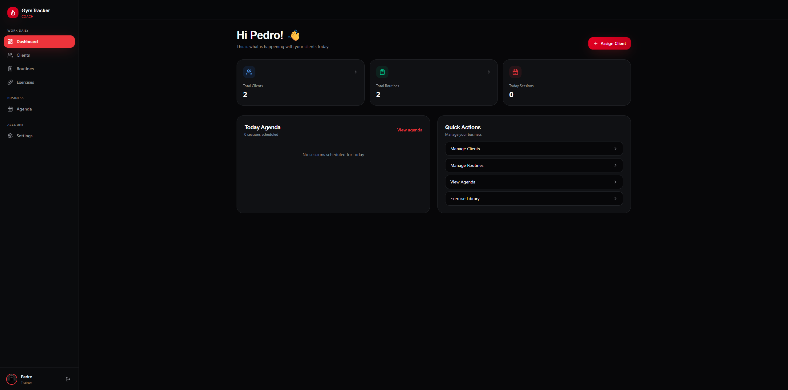
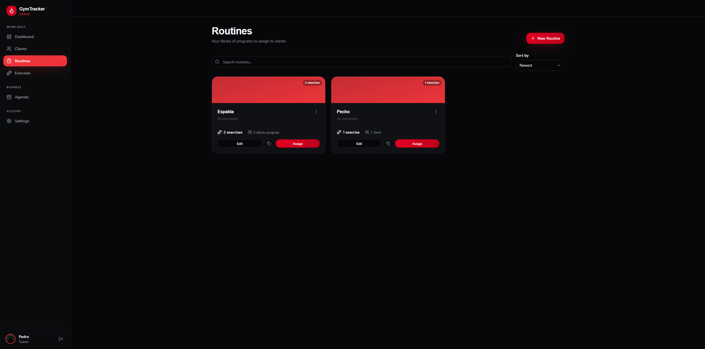
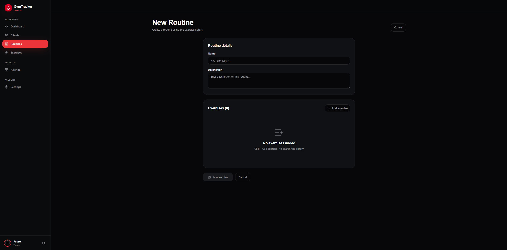
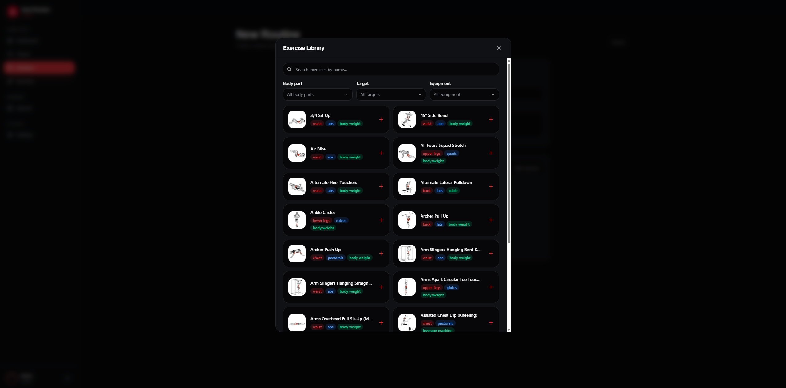

<p align="center">

</p>

# 🏋️ GymTracker Pro

<p align="center">
  <strong>A modern Full Stack web application for gym management.</strong><br>
  Designed for <strong>Trainers</strong>, <strong>Clients</strong> and <strong>Administrators</strong>.
</p>

---
  
<p align="center">

<a href="https://gym-tracker-pro-beta.vercel.app">

</a>

<a href="https://github.com/GymTracker-4Geeks/GymTracker-Pro-WEBAPP">

</a>

</p>

---

<p align="center">


</p>

---

## 📖 Overview

GymTracker Pro is a Full Stack fitness management platform built as my final Bootcamp project.

It enables trainers to manage clients, create and assign workout routines, while allowing clients to track workouts, body weight, and progress through a modern and responsive interface.

The application follows a clean architecture using **Next.js** for the frontend and **Flask** for the backend, implementing secure authentication with JWT and password recovery through SendGrid.

---

# ✨ Features

## 👨‍🏫 Trainer

- Dashboard with statistics
- Client Management
- Create/Edit/Delete Clients
- Routine Builder
- Assign routines to clients
- Exercise Library integration
- Exercise Management
- Profile Settings

---

## 🏋️ Client

- Dashboard
- View assigned routines
- Exercise Library
- Workout Logs
- Body Weight Tracking
- Progress Dashboard
- Profile Settings

---

## 👑 Administrator

- Dashboard
- User Management
- Role Management
- Search users
- Infinite scroll

---

## 🔐 Authentication

- User Registration
- Login
- JWT Authentication
- Role-based Authorization
- Protected Routes
- Forgot Password
- Password Reset
- SendGrid Email Integration
- Single-use Reset Tokens
- 15-minute Token Expiration

---

# 📊 Main Features

- ✅ JWT Authentication
- ✅ Role-Based Access
- ✅ Trainer Dashboard
- ✅ Client Dashboard
- ✅ Admin Dashboard
- ✅ Workout Routine Management
- ✅ Exercise Library (1300+ exercises)
- ✅ Workout Tracking
- ✅ Body Weight Tracking
- ✅ Progress Analytics
- ✅ Password Recovery
- ✅ Responsive Design

---

# 🛠 Tech Stack

## Frontend

- Next.js (App Router)
- React
- TypeScript
- Tailwind CSS
- Lucide React

---

## Backend

- Flask
- Flask-SQLAlchemy
- Flask-JWT-Extended
- Flask-Migrate
- Flask-CORS

---

## Database

- SQLite

---

## Email Service

- SendGrid

---

## Tools

- Git
- GitHub
- VS Code
- Postman

---

# 🏗 Architecture

```
Frontend (Next.js)

Landing
│
├── Authentication
│   ├── Login
│   ├── Register
│   ├── Forgot Password
│   └── Reset Password
│
├── Trainer
│   ├── Dashboard
│   ├── Clients
│   ├── Routines
│   ├── Exercises
│   └── Settings
│
├── Client
│   ├── Dashboard
│   ├── Routines
│   ├── Exercises
│   ├── Workout Logs
│   ├── Body Weight
│   ├── Progress
│   └── Settings
│
└── Admin
    ├── Dashboard
    └── Users

```

---

# 🗄 Database

Main entities:

- User
- Trainer
- Client
- Routine
- Exercise
- ExerciseLibrary
- ClientRoutine
- WorkoutLog
- BodyWeight

Relationships:

```
User
├── Trainer
│     ├── Clients
│     ├── Routines
│
└── Client
      ├── Workout Logs
      ├── Body Weight
      └── Assigned Routines

Routine
└── Exercises

Exercise
└── Exercise Library

```

---

# 📂 Project Structure

```
frontend/
├── app/
├── components/
├── context/
├── hooks/
├── lib/
├── services/
└── types/

backend/
├── api/
├── migrations/
├── models/
├── routes/
├── services/
├── utils/
└── app.py

```

---

# 🚀 Installation

## Clone repository

```bash
git clone https://github.com/GymTracker-4Geeks/GymTracker-Pro-WEBAPP.git

cd GymTracker-Pro-WEBAPP
```

---

## Backend

```bash
cd backend

python -m venv venv

source venv/bin/activate
```

Windows

```bash
venv\Scripts\activate
```

Install dependencies

```bash
pip install -r requirements.txt
```

Run migrations

```bash
flask db upgrade
```

Run backend

```bash
flask run
```

---

## Frontend

```bash
cd frontend

npm install

npm run dev
```

---

# ⚙ Environment Variables

## Backend (.env)

```env
SECRET_KEY=

JWT_SECRET_KEY=

DATABASE_URI=

SENDGRID_API_KEY=

EMAIL_SENDGRID=

FRONTEND_URL=http://localhost:3000
```

---

## Frontend (.env.local)

```env
NEXT_PUBLIC_FLASK_API_URL=http://localhost:5000/api
```

---

# 📧 Password Recovery

The application includes a complete password recovery workflow.

Features:

- SendGrid email integration
- Secure token generation
- 15-minute expiration
- Single-use tokens
- Automatic invalidation after password change
- Protected Reset Password page

---

# 💪 Exercise Library

GymTracker Pro includes an exercise library with more than **1300 exercises**.

Each exercise contains:

- Name
- Target Muscle
- Equipment
- Difficulty
- Category
- Image

The library is used by trainers when creating workout routines.

---

# 📈 Progress Tracking

Clients can monitor:

- Workout history
- Body weight history
- Weekly workout volume
- Total workouts
- Most performed exercises
- Weight evolution

---

# 🔒 Security

- JWT Authentication
- Protected API endpoints
- Role-based authorization
- Password hashing
- Secure password reset tokens
- Token expiration
- One-time password reset links

---

# 📱 Responsive Design

The application has been designed for:

- Desktop
- Tablet
- Mobile

Including:

- Responsive sidebar
- Mobile navigation
- Responsive dashboards
- Responsive forms

---

# 🛣 Future improvements

- PostgreSQL support
- Nutrition module
- Calendar
- Notifications
- Exercise videos
- Charts with Recharts
- File uploads
- Trainer analytics
- Docker support

---

# 📸 Screenshots

### Landing Page



### Trainer Dashboard



### Routines Page



### Routine Builder



### Routine Builder Exercises



---

# 👨‍💻 Author

**David Evora**

- LinkedIn: https://linkedin.com/in/davidevora
- GitHub: https://github.com/DavidEvora

---

# 📚 What I Learned

Developing GymTracker Pro allowed me to gain practical experience in:

- Designing a scalable Full Stack architecture.
- Building REST APIs with Flask.
- JWT Authentication and Role-Based Authorization.
- SQLAlchemy relationships and database migrations.
- Deploying production applications on Render and Vercel.
- Managing environment variables and production configuration.

---

# 📄 License

This project was developed for educational purposes as part of a Full Stack Development Bootcamp.
